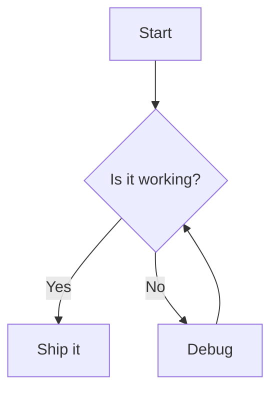
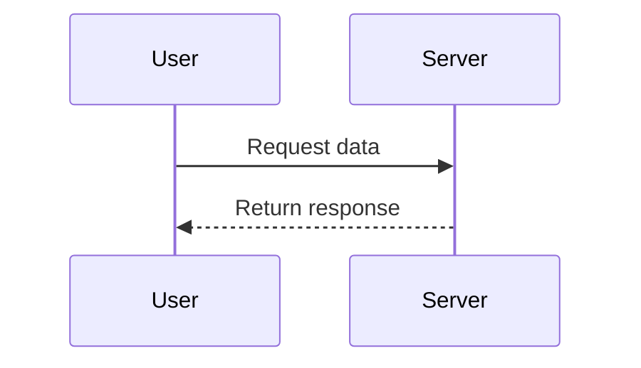

# Markdown Feature Reference

This document demonstrates every major Markdown feature, including standard CommonMark syntax and popular GitHub-Flavored Markdown (GFM) extensions. The raw source is where the real learning is. Open this file in a text editor alongside a rendered preview to compare.

---

## 1. Headers

Headers use `#` symbols. There are six levels.

# H1 — Largest Header
## H2 — Section Header
### H3 — Subsection
#### H4 — Sub-subsection
##### H5 — Minor Header
###### H6 — Smallest Header

An alternate syntax exists for H1 and H2 using underlines:

Alternate H1
============

Alternate H2
------------

---

## 2. Paragraphs and Line Breaks

This is a paragraph. It is just text separated from other blocks by a blank line.

This is a second paragraph. To force a line break within a paragraph,
end a line with two trailing spaces, or use a backslash\
like this.

---

## 3. Emphasis and Text Styling

*Italic text* using single asterisks, or _single underscores_.

**Bold text** using double asterisks, or __double underscores__.

***Bold and italic*** using triple asterisks.

~~Strikethrough~~ using double tildes (GFM).

You can ==highlight text== with double equals (supported in some renderers).

Subscript: H~2~O and superscript: X^2^ (extension-dependent).

`Inline code` uses single backticks.

---

## 4. Blockquotes

> This is a blockquote.
>
> It can span multiple paragraphs if you keep the `>` marker.
>
> > Blockquotes can be nested by adding more `>` symbols.
> >
> > > Three levels deep here.

> **Note:** You can use other Markdown *inside* blockquotes, including **bold**, lists, and `code`.

---

## 5. Lists

### Unordered Lists

- First item
- Second item
  - Nested item (indent with two or four spaces)
  - Another nested item
    - Even deeper
- Third item

You can also use `*` or `+` as bullet markers:

* Asterisk bullet
+ Plus bullet

### Ordered Lists

1. First item
2. Second item
   1. Nested ordered item
   2. Another nested item
3. Third item

Numbers don't have to be sequential in the source — the renderer fixes them:

1. This will render as 1
1. This will render as 2
1. This will render as 3

### Task Lists (GFM)

- [x] Completed task
- [ ] Incomplete task
- [ ] Another pending task
  - [x] Nested completed subtask

---

## 6. Code

### Inline Code

Use `printf()` to print, or wrap a command like `git status` in backticks.

### Fenced Code Blocks

Use triple backticks with an optional language identifier for syntax highlighting:

```python
def greet(name):
    """A simple greeting function."""
    return f"Hello, {name}!"

print(greet("world"))
```

```java
public class Main {
    public static void main(String[] args) {
        System.out.println("Hello, world!");
    }
}
```

```bash
#!/bin/bash
docker compose up -d
echo "Containers started"
```

```json
{
  "name": "example",
  "version": "1.0.0",
  "active": true
}
```

### Indented Code Blocks

You can also create a code block by indenting four spaces:

    This is an indented code block.
    No syntax highlighting here.

---

## 7. Tables (GFM)

Basic table:

| Name     | Role          | Years |
|----------|---------------|-------|
| Alice    | Engineer      | 5     |
| Bob      | Designer      | 3     |
| Carol    | Product Lead  | 8     |

Column alignment is controlled by colons in the separator row:

| Left-aligned | Center-aligned | Right-aligned |
|:-------------|:--------------:|--------------:|
| Apples       | Bananas        | 100           |
| Cherries     | Dates          | 2,500         |
| Figs         | Grapes         | 42            |

Inline formatting works inside cells:

| Feature      | Syntax              | Example          |
|--------------|---------------------|------------------|
| Bold         | `**text**`          | **bold**         |
| Italic       | `*text*`            | *italic*         |
| Code         | `` `text` ``        | `code`           |
| Link         | `[text](url)`       | [link](https://example.com) |

---

## 8. Links

Inline link: [Visit Example](https://example.com)

Inline link with title: [Hover me](https://example.com "This is a tooltip")

Reference-style link: [Click here][ref-id]

Automatic link: <https://example.com>

Linking to a heading on the same page: [Jump to Tables](#7-tables-gfm)

[ref-id]: https://example.com "Optional title for reference link"

---

## 9. Images

Inline image:


Reference-style image:

![Alt text][image-ref]

Linked image (image that is also a clickable link):

[](https://example.com)

[image-ref]: https://via.placeholder.com/200

---

## 10. Horizontal Rules

Three or more hyphens, asterisks, or underscores on their own line:

---

***

___

---

## 11. Escaping Characters

Use a backslash to display literal Markdown characters:

\*This text is surrounded by literal asterisks, not italicized\*

\# This is a literal hash, not a header

Characters you can escape: `\` `` ` `` `*` `_` `{}` `[]` `()` `#` `+` `-` `.` `!` `|`

---

## 12. Footnotes (extension)

Here is a statement that needs a citation.[^1] And here is another.[^note]

[^1]: This is the first footnote.
[^note]: Footnotes can have multi-word identifiers and contain **formatting**.

---

## 13. Definition Lists (extension)

Term 1
: Definition of the first term.

Term 2
: Definition of the second term.
: A term can have multiple definitions.

---

## 14. Inline HTML

Markdown lets you drop down to raw HTML when you need features it doesn't cover:

<div align="center">
  This text is centered using an HTML div.
</div>

<details>
  <summary>Click to expand a collapsible section</summary>

  Hidden content goes here. This is great for FAQs, spoilers, or long logs.
  You can include **Markdown** inside the expanded region in most renderers.
</details>

Use <kbd>Ctrl</kbd> + <kbd>C</kbd> to copy, rendered with the `<kbd>` tag.

This is text with <sub>subscript</sub> and <sup>superscript</sup> via HTML tags.

---

## 15. Emoji (GFM)

GitHub and many renderers support emoji shortcodes:

:smile: :rocket: :tada: :+1: :coffee: :warning: :bulb:

You can usually also paste Unicode emoji directly: 🚀 ✅ 🎉

---

## 16. Math (extension — LaTeX via KaTeX/MathJax)

Inline math: the famous equation is $E = mc^2$.

Block math:

$$
\int_{a}^{b} f(x)\,dx = F(b) - F(a)
$$

$$
\begin{aligned}
(a + b)^2 &= a^2 + 2ab + b^2 \\
(a - b)^2 &= a^2 - 2ab + b^2
\end{aligned}
$$

---

## 17. Diagrams (Mermaid — supported on GitHub and many tools)





---

## 18. Comments

Markdown has no native comment syntax, but HTML comments are not rendered:

<!-- This is a comment. It will not appear in the rendered output. -->

---

## Notes on Portability

Not every feature works everywhere. The table below summarizes support:

| Feature              | CommonMark | GitHub (GFM) | Notes                          |
|----------------------|:----------:|:------------:|--------------------------------|
| Headers, lists, links|     ✅     |      ✅      | Universal                      |
| Tables               |     ❌     |      ✅      | GFM extension                  |
| Task lists           |     ❌     |      ✅      | GFM extension                  |
| Strikethrough        |     ❌     |      ✅      | GFM extension                  |
| Footnotes            |     ❌     |      ✅      | GitHub + many others           |
| Math (LaTeX)         |     ❌     |      ✅      | GitHub added support in 2022   |
| Mermaid diagrams     |     ❌     |      ✅      | GitHub + GitLab + others       |
| Definition lists     |     ❌     |      ❌      | Pandoc, kramdown, etc.         |
| Highlight `==text==` |     ❌     |      ❌      | Obsidian, some others          |

When in doubt, stick to CommonMark plus GFM for the widest compatibility.
